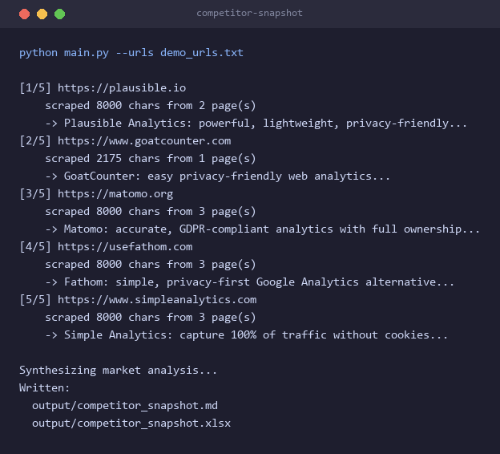

# competitor snapshot

give it a list of competitor urls, it scrapes each site, extracts a structured profile with gemini (usp, target audience, key features, pricing) and produces a side-by-side comparison as markdown and excel, plus an ai market-gap analysis across the whole set

## the problem

before a launch or a positioning call someone has to open a dozen competitor sites, read the homepage, hunt for the pricing page, skim the features and try to hold it all in their head, it takes most of a day and the "so where's the gap?" answer is usually a gut feeling

## what it does

- scrapes the pages that matter, for each url it grabs the homepage and auto-finds the pricing and features pages from the site's own nav, then pulls the main text out with trafilatura
- structured extraction grounded in the page, each site's text goes to gemini which returns name, usp, target audience, key features and pricing model (unstated pricing comes back as "not stated" not a guess)
- comparison in two formats, a markdown table plus a styled excel workbook with a comparison sheet and a market insight sheet
- a real conclusion not just a table, a final pass looks at all the profiles together and returns the table-stakes, each player's differentiators, and one concrete market gap
- robust to real sites, missing subpages, network errors and javascript-only sites are skipped with a clear message instead of crashing the run

## result

ran live against five real privacy-focused web analytics products, every profile below came from the live sites



the market-gap pass landed on a specific wedge - a privacy-first analytics tool with prescriptive ai recommendations for smb ecommerce, sitting between the basic tools and matomo's complexity, the kind of conclusion the manual version takes a day to reach

## run it

```
pip install -r requirements.txt
cp .env.example .env          # add your GEMINI_API_KEY, free from https://ai.google.dev
python main.py --urls demo_urls.txt
```

point it at your own market by editing `demo_urls.txt`, respect each site's robots.txt

## files

```
main.py         cli, scrape -> analyze -> compare -> synthesize
scraper.py      fetch + sub-page discovery + trafilatura text extraction
analyzer.py     gemini profile extraction + market-gap synthesis
report.py       markdown table + styled excel workbook
demo_urls.txt   the demo competitor list
```
